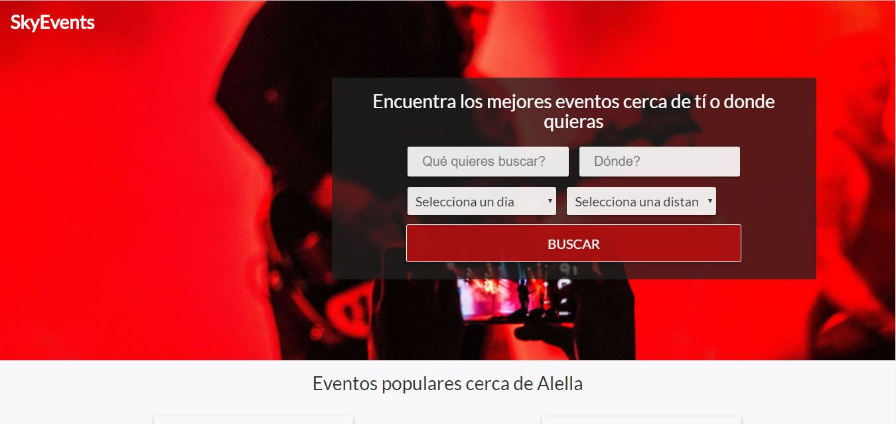
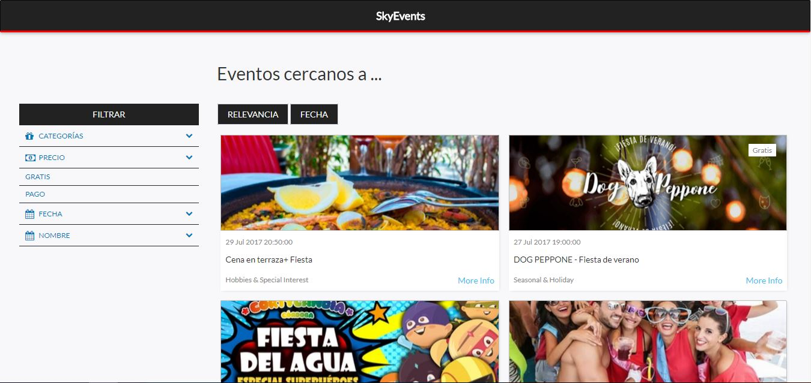
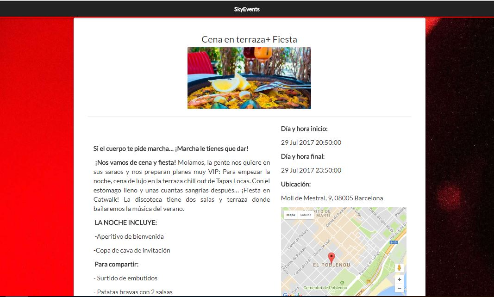
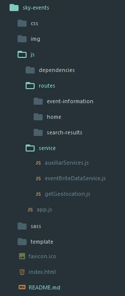

[skyEvents](https://devtoni.github.io/sky-events-project/)
==================

skyEvents es un proyeto de front-end, el cual sirve como buscador de eventos. Este proyecto consta de una pagina principal, la cual esta divida en dos partes:

-**El buscador:** Consta de 2 inputs para buscar por Categoria del evento y por la localización. También hay dos options para buscar por rango de fecha y rango de distancia.

-**Eventos mas populares:** Nos muestra unas tarjetas de los eventos mas populares de la localización en la que nos encontramos.

**La siguente parte** es una vez hecha una busqueda, no sale la pantalla con los resultados de la busqueda en tarjetas y con un aside lateral de los filtros(categoria, precio, fecha, nombre del evento) y una barra para la paginación de la web.

**La ultima parte** del proyecto es cuando clicas a un evento en particular el cual te sale la información general del cual, nombre, descripción, hora y fecha de inicio y final y el mapa con la ubicación exacta.

Estructura del projecto
---------------------------

La estructura de nuestro poryecto es la siguiente:

Dentro de la carpeta de routes, tenemos las routas de las paginas con sus controladores, su template y su index.js.

Tecnologia usada
-------------------

Para hacer este proyecto hemos usado la siguiente tecnologia:
- HTML5
- SCSS
- BOOTSTRAP
- ANGULAR JS
    + LLAMADA A LA API DE GOOGLE MAPS
    + LLAMADA A LA API DE EVENBRITE
    + LLAMADA A UNA API DE GEOLOCALIZACIÓN

